# project_po — Управление требованиями для Product Owner

Локальное приложение, в котором Product Owner описывает **функциональные (ФТ)** и
**нефункциональные (НФТ)** требования продукта, строит между ними древовидные связи,
приоритизирует их (источники + RICE) и хранит результат в **машиночитаемом Markdown** —
чтобы требования можно было отдавать ИИ-агентам как источник истины.

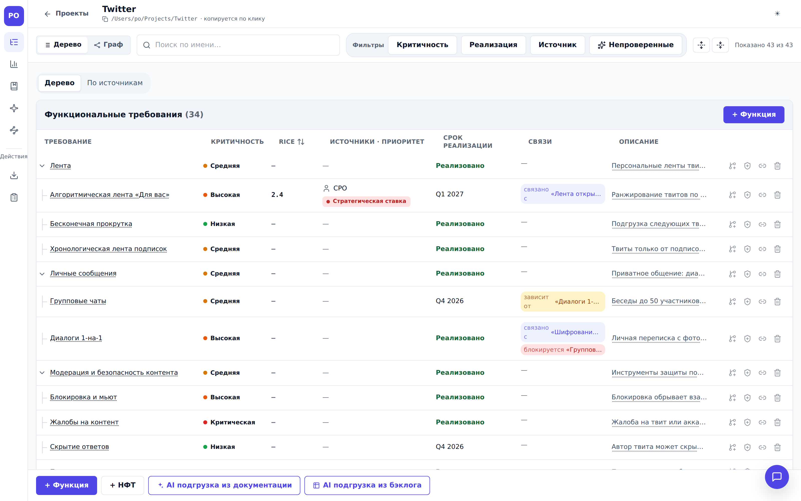

> Все скриншоты в README сняты с работающего приложения на демо-описании продукта
> **Twitter**: 43 требования — 8 функциональных доменов (лента, твиты, профили,
> социальный граф, уведомления, поиск, личные сообщения, модерация) и НФТ по
> производительности, надёжности и безопасности, с RICE-оценками, источниками,
> сроками и связями между ветками.

## Ключевые принципы

- **Без базы данных.** Источник истины — файлы на диске в каталоге `Projects/`.
  Каждое требование — отдельный `.md`-файл; проект можно посмотреть и поправить любым редактором.
- **Формат — OpenSpec.** Требования хранятся в OpenSpec-разметке
  (`### Requirement:` / `#### Scenario:`), которую ИИ-агент читает без парсера.
  Подробнее — `docs/architecture/ADR-001-openspec-storage.md`.
- **Локальный запуск.** Браузерный SPA + локальный Node-сервер, который выполняет все
  операции с файловой системой и раздаёт фронтенд. Один процесс — всё приложение.
- **Готово к ИИ.** Три интеграционных канала: OpenSpec-выгрузка, REST API со Swagger
  и MCP-сервер (stdio) — все поверх одной и той же доменной логики.
- **ИИ внутри портала.** AI-импорт требований из архива документации и из выгрузки
  бэклога (xlsx), чат по проекту, генерация описаний — через любой OpenAI-совместимый API.

## Возможности

### Требования и связи

- Два раздела — «Функциональные требования» и «Нефункциональные требования»;
  дерево функций → подфункций без ограничения вложенности, режимы «Дерево» и «По источникам».
- Карточка требования: название (живая проверка уникальности), критичность
  (5 уровней, от «Низкая» до «Блокер»), описание и сценарии (Markdown),
  «реализовано / не реализовано» с планом (квартал/год) и датой выпуска.
  Изменения **сохраняются сразу** в `.md`-файл.
- Связи: `PARENT_OF`/`CHILD_OF` (иерархия), `RELATES_TO`, `DEPENDS_ON`, `BLOCKED_BY`.
  Ядро гарантирует целостность: нет циклов, один родитель, нет self-link и висячих ссылок.
- Работа с деревом: поиск по имени (предки совпадений показываются как контекст),
  мультиселект-фильтры по критичности / реализации / источнику / «Непроверенные»,
  раскрыть/свернуть все уровни (шеврон работает точечно в любом режиме),
  боковая панель с Markdown-рендером описания.
- **Граф связей** — альтернативное представление проекта с легендой типов узлов и рёбер;
  битые файлы подсвечиваются с текстом ошибки.

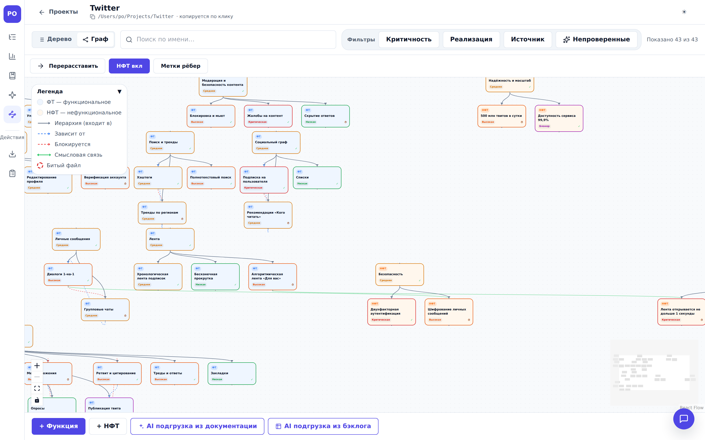

### Приоритизация (для PO)

- У требования — список **источников** (клиент/сделка, стейкхолдер, внутренний стандарт,
  текст, бэклог), у каждого — приоритет, желаемый срок и **RICE-оценка**
  (`score = R×I×C/Effort`, вычисляется в ядре). Итог требования — max RICE и старший приоритет.
- **Справочники проекта** (`/p/:id/dictionaries`): приоритеты источников
  (название + цвет + старшинство) и сами источники; целостность при удалении
  (перенос на другой приоритет).
- **Дашборд** (`/p/:id/dashboard`): топ-5 по RICE, качество описаний, срезы по проекту.

|          Вкладка «Приоритизация»: источники, RICE, решение PO          |     Дашборд: топ-5 по RICE и качество описаний     |
| :--------------------------------------------------------------------: | :------------------------------------------------: |
| 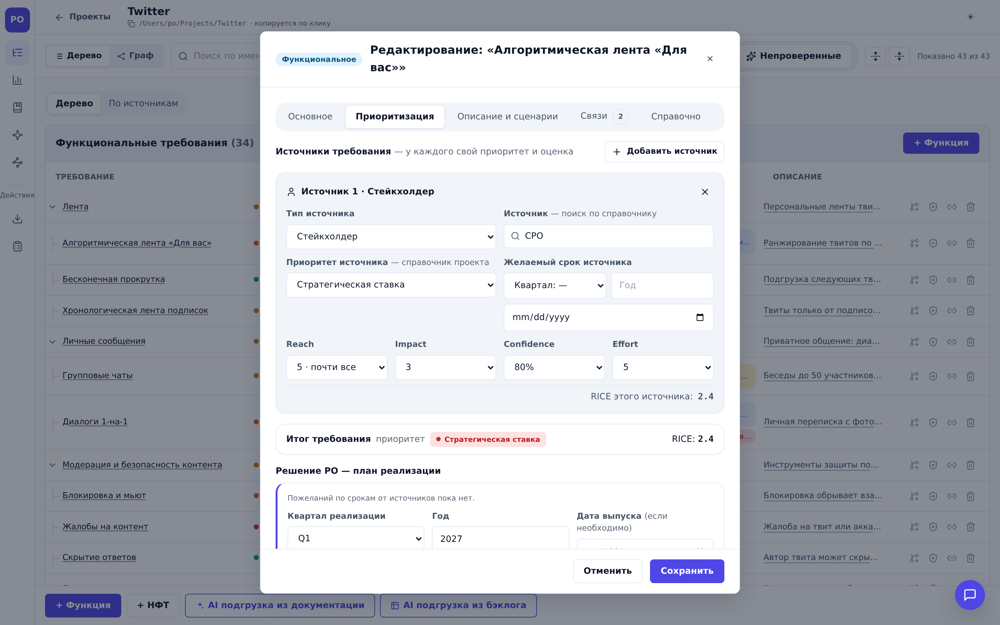 | 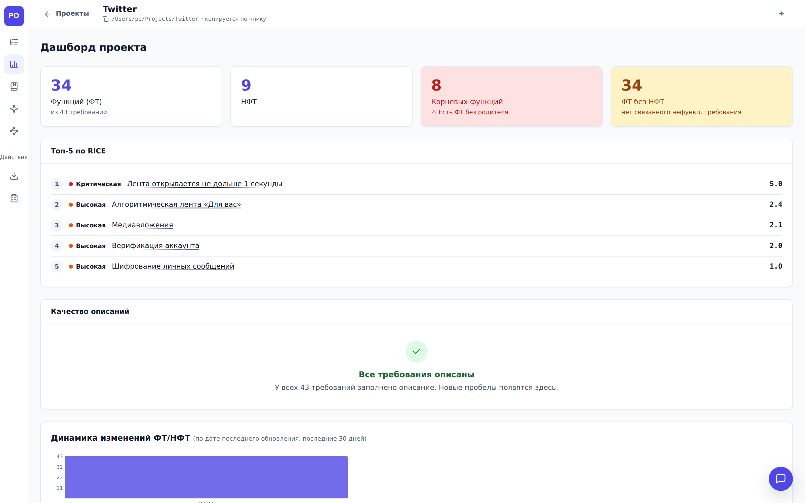 |

### Импорт / экспорт

- Экспорт проекта в архив `.zip` / `.tar.gz` (полный или только выбранные требования) —
  пригоден для повторного импорта; архивы с папкой-обёрткой поддерживаются.
- Экспорт в **Excel** (`.xlsx`) — лист «Требования», зеркалит таблицу портала
  (только выгрузка, не импортируется).
- **Генерация артефактов** — выгрузка `.md`-файла: задачи для трекера по выбранным
  требованиям и три тестовые модели (см. следующий раздел).

### Генерация тестовых моделей: смок · крит-регресс · полный регресс

Из дерева требований портал собирает три модели тестирования, каждая — со своим
правилом отбора ФТ:

- **Smoke-модель** — быстрые проверки «функция жива»: BLOCKER/CRITICAL/HIGH,
  корни дерева и нереализованные ФТ;
- **Критический регресс** — BLOCKER/CRITICAL, «широкие» узлы (≥3 детей) и
  нереализованные, позитив + обязательный негатив (с вопросом о включении
  нереализованных ФТ);
- **Полный регресс** — все ФТ в порядке BFS-обхода дерева, сценарии P/N/B.

После выбора направления — **развилка способа генерации**:

|              Шаг «Способ»: шаблон или AI               |           AI-экран: модель, чекбокс, живой журнал           |
| :----------------------------------------------------: | :---------------------------------------------------------: |
| 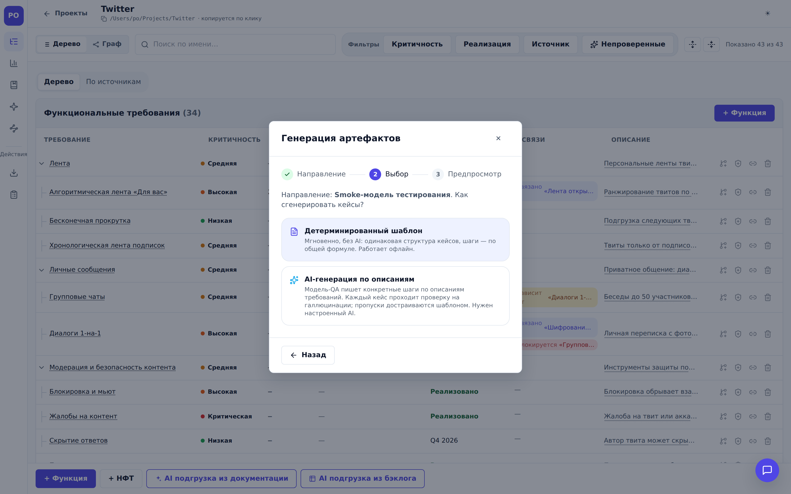 | 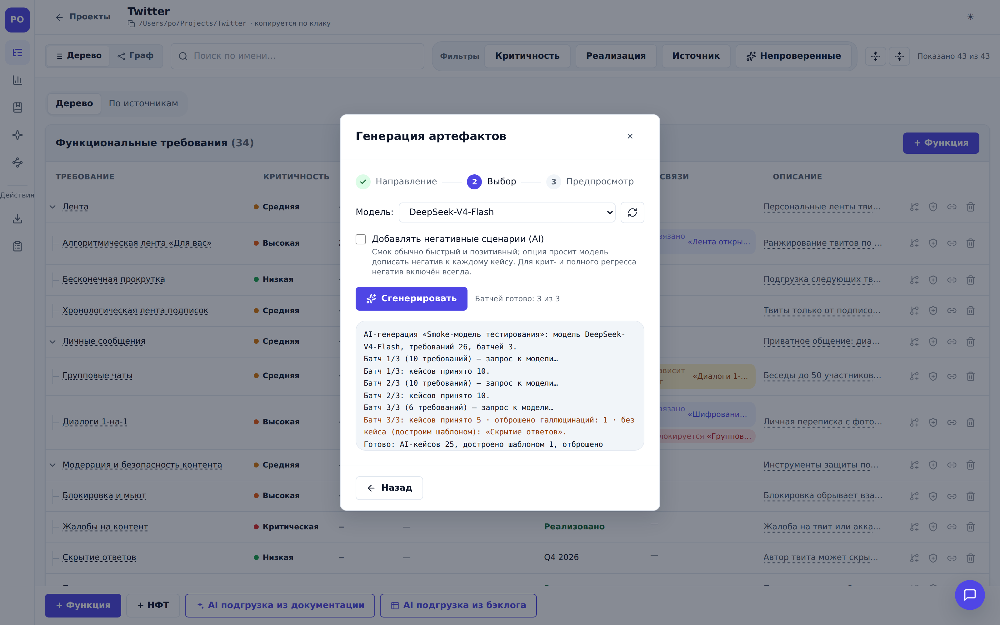 |

1. **Детерминированный шаблон** — мгновенно и офлайн: единая структура кейсов
   (front-matter `tc-id`/`req-slug`/`priority`, для полной модели — `parent-tc`),
   шаги по общей формуле.
2. **AI-генерация по описаниям** — модель-QA пишет конкретные шаги по описаниям
   требований. Выбор модели с обновлением списка (как в AI-импорте), для смок —
   чекбокс «Добавлять негативные сценарии», живой журнал прогона. Клиент режет
   отбор на батчи по 10 требований; на каждый батч сервер делает один вызов хаба
   (`POST /api/ai/generate-tests`, structured output с фолбэком).

**Проверка на галлюцинации** — детерминированная, на сервере: каждый кейс обязан
ссылаться на `slug` требования из своего батча. Кейсы с чужим или выдуманным
slug'ом, повторы и невалидные формы **отбрасываются** (счётчик `dropped`);
требования, которые модель пропустила, возвращаются списком `missing` и
**достраиваются детерминированным шаблоном** при сборке файла — покрытие модели
не зависит от дисциплины LLM. Итоговый файл честно помечает каждый кейс
(`source: ai` / `source: template-fallback`) и несёт счётчики проверки в шапке:

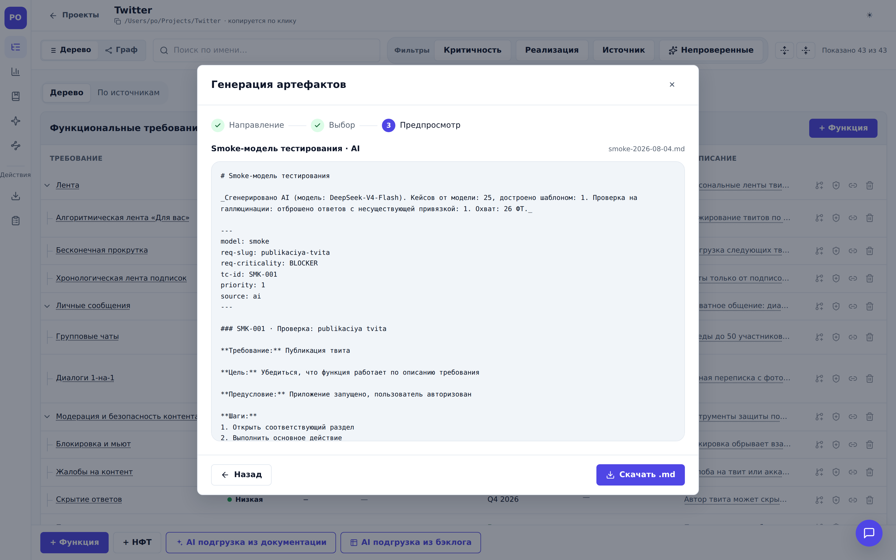

### AI-функции (через OpenAI-совместимый хаб)

- **AI-импорт документации:** архив с документацией продукта (до 200 МБ / 2000 файлов)
  превращается в дерево ФТ/НФТ со связями. Конвейер: опись и классификация источников →
  смета токенов с подтверждением → извлечение → построение дерева → запись; чекпоинты
  после каждого фрагмента, resume после сбоя без повторной оплаты, батчинг мелких файлов,
  адаптивные фрагменты и structured output для слабых моделей, русская таксономия ошибок
  с планом действий, итоговый отчёт качества и лог файлом.
- **Логическое дерево «навык AI Product Owner»** (чекбокс в модалке импорта, поле
  `buildTree`): вместо повторения структуры файлов модель-PO проектирует бизнес-таксономию
  (домены → разделы) и раскладывает по ней все ФТ/НФТ; группирующие узлы создаются как
  требования с пометкой «ИИ». Рекомендуется для больших архивов — без опции сотни
  требований чаще остаются плоским списком.
- **AI-импорт бэклога (xlsx):** выгрузка Jira-типа («Issue key» + «Summary») размечается
  моделью по существующему дереву; перед записью — **шаг выверки** (гейт PO) с
  редактированием имени, целевого узла и срока; до подтверждения в проект не пишется ничего.
  Лог — построчный и человекочитаемый: «исходная формулировка → созданное требование»
  с узлом, сроком и вердиктом по дублю.
- **Подсветка непроверенного:** созданные ИИ требования помечены (`origin`, бейдж «ИИ»)
  до ручной отметки «Проверено»; фильтр и счётчик «Не проверено: N».
- **Чат по проекту** (виджет) и **генерация/дополнение описания** в карточке требования.
- **Пресеты моделей:** редактируемые best-practice параметры на модель (temperature,
  бюджет токенов, размер фрагмента, reasoning-strip для «думающих» моделей, тайм-ауты,
  параллелизм, бюджет прогона); embedding-модели отсекаются от генерации с понятной ошибкой.

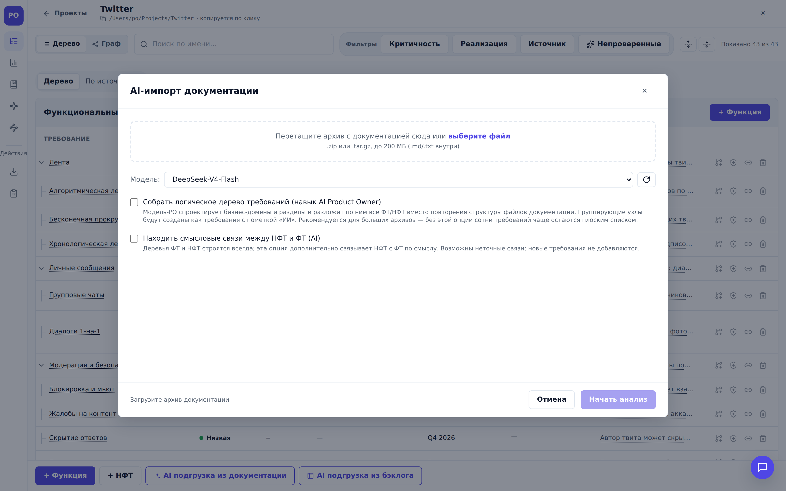

### Как работает AI-разбор документации

Цвета на схемах: 🟣 фиолетовое — вызовы модели, 🟡 янтарное — гейты PO (без
подтверждения дальше ничего не происходит), 🟢 зелёное — запись на диск,
🔴 красное — выходы без записи.

```mermaid
flowchart TD
    A["Загрузка архива .zip / .tar.gz<br/>лимит 200 МБ · 2000 текстовых файлов"] --> B["Распаковка<br/>защита от zip-slip · папка-обёртка · отсев __MACOSX"]
    B --> C["Опись и классификация источников ПО СОДЕРЖИМОМУ<br/>release notes · руководства · API · безопасность · прочее"]
    C --> D["Смета прогона:<br/>файлы · фрагменты · вызовы · токены"]
    D --> E{"Смета выше порога?<br/>(настраивается, дефолт 2 млн токенов)"}
    E -- "да" --> F[["Гейт PO:<br/>«Запустить всё равно»"]]
    E -- "нет" --> G
    F -- "отказ" --> X(["Отменено —<br/>ни одного вызова модели"])
    F -- "подтверждено" --> G["Извлечение ФТ/НФТ из фрагментов<br/>батчинг мелких файлов · адаптивное деление фрагментов<br/>structured output · few-shot по классу источника"]
    G --> H["Дедупликация извлечённого<br/>нормализация + fuzzy · спорные пары решает модель"]
    H --> I{"Чекбокс «Собрать логическое<br/>дерево (навык AI PO)»?"}
    I -- "выкл" --> J["Структуризация по документации:<br/>родители только из извлечённого набора"]
    I -- "вкл" --> K["Проектирование бизнес-таксономии<br/>домены → разделы · map-reduce по батчам имён (150)"]
    K --> L["Раскладка требований по узлам<br/>по коротким id «F1.2» · батчи по 40"]
    J --> M["Агрегация: резолв родителей ·<br/>разрыв циклов · отсев галлюцинаций"]
    L --> M
    M --> N["Запись в проект: требования + группы<br/>CHILD_OF · RELATES_TO из явных упоминаний<br/>идемпотентно · origin: AI_DOCS (бейдж «ИИ»)"]
    N --> O{"Чекбокс «Находить смысловые<br/>связи НФТ↔ФТ»?"}
    O -- "да" --> P["Смысловые пары RELATES_TO<br/>best-effort: сбой шага не валит импорт"]
    O -- "нет" --> Q
    P --> Q(["Готово: отчёт качества по классам ·<br/>usage-токены · лог файлом"])

    classDef step fill:#e0e7ff,stroke:#4f46e5,color:#312e81
    classDef ai fill:#ede9fe,stroke:#7c3aed,color:#4c1d95
    classDef gate fill:#fef3c7,stroke:#d97706,color:#78350f
    classDef fs fill:#dcfce7,stroke:#16a34a,color:#14532d
    classDef stop fill:#fee2e2,stroke:#dc2626,color:#7f1d1d
    class A,B,C,D,E,I,M,O step
    class G,H,J,K,L,P ai
    class F gate
    class N,Q fs
    class X stop
```

Устойчивость на каждом шаге с вызовами модели: ретраи 429/5xx/тайм-аутов с
backoff и Retry-After, пул параллельных вызовов со сбросом до 1 при 429 и
постепенным восстановлением, чекпоинт в `Projects/<проект>/.ai-jobs/<jobId>/`
после каждого фрагмента — `failed`/`cancelled`/`interrupted` прогон продолжается
кнопкой «Продолжить» с места остановки, пройденные фрагменты повторно не
оплачиваются.

### Как работает AI-разбор бэклога (xlsx)

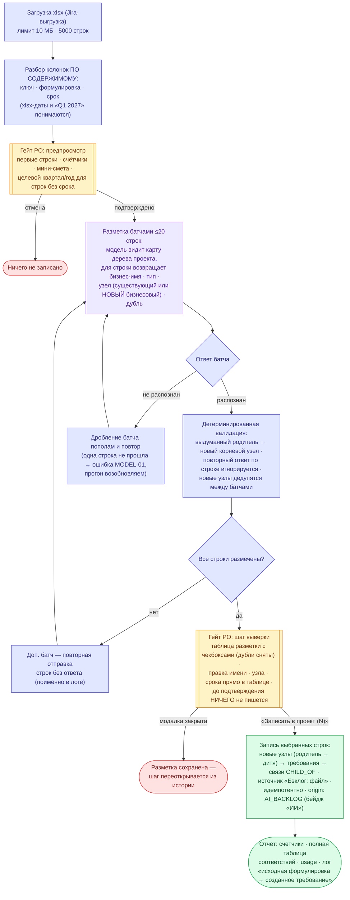

Чекпоинт пишется после каждого размеченного батча: при сбое или рестарте
сервера «Продолжить» дозапрашивает только строки без разметки — оплаченные
батчи из чекпоинта повторно в модель не уходят.

## Требования

- **Node.js ≥ 20** (CI использует 22) и npm.

## Быстрый старт

```bash
git clone <repo> project_po && cd project_po
npm install            # монорепо (npm workspaces): установит зависимости всех пакетов
npm run build          # сборка core + server + web (+ mcp)
node apps/server/dist/main.js
```

Откройте <http://127.0.0.1:3000> — сервер раздаёт SPA на `/`, API на `/api`
и Swagger UI на `/docs`. Проекты сохраняются в `./Projects/` (создаётся автоматически).

### Одна команда (на новой машине)

```bash
git clone <repo> project_po && cd project_po && bash start.sh
```

Скрипт `start.sh` проверяет версию Node, выполняет `npm install` → `npm run build` →
`node apps/server/dist/main.js` и показывает прогресс установки.

### Переменные окружения (сервер)

| Переменная      | По умолчанию      | Назначение                                 |
| --------------- | ----------------- | ------------------------------------------ |
| `PORT`          | `3000`            | Порт HTTP                                  |
| `HOST`          | `127.0.0.1`       | Хост                                       |
| `PROJECTS_ROOT` | `<repo>/Projects` | Где хранятся проекты (каждый — подкаталог) |
| `LOG_LEVEL`     | `info`            | Уровень логов (pino)                       |

### Настройка AI (опционально)

Экран «Настройка AI» (`/p/:id/ai`): Base URL OpenAI-совместимого API, API-ключ и модель.
Конфигурация хранится локально в `Projects/.ai-config.json` (ключ наружу через API не
отдаётся и в архивы/дистрибутив не попадает). Там же — пресеты параметров моделей.
Без настроенного AI все остальные функции портала работают полностью.

## Как пользоваться

1. **Стартовый экран:** «Новый проект» / «Импорт» / «Открыть существующий»,
   блок недавних проектов и «Сервисные функции» — экраны-инструкции по
   AI-ready API, REST API и MCP.
2. **Главный экран проекта:** дерево ФТ/НФТ (или граф связей), тулбар с поиском и
   фильтрами, сайдбар с навигацией (Требования / Дашборд / Настройка AI / Справочники)
   и действиями (Экспорт / Генерация задач). Кнопки «AI подгрузка из документации» и
   «AI подгрузка из бэклога» — под деревом.
3. **Создание/редактирование** — в модальном окне с вкладками: Основное /
   Приоритизация (источники + RICE + решение PO по срокам) / Описание и сценарии /
   Связи / Справочно. Сохранение — без подтверждения, с тостом «Сохранено».

|                   Стартовый экран с недавними проектами                    |           Карточка требования (вкладки, критичность)           |
| :------------------------------------------------------------------------: | :------------------------------------------------------------: |
|               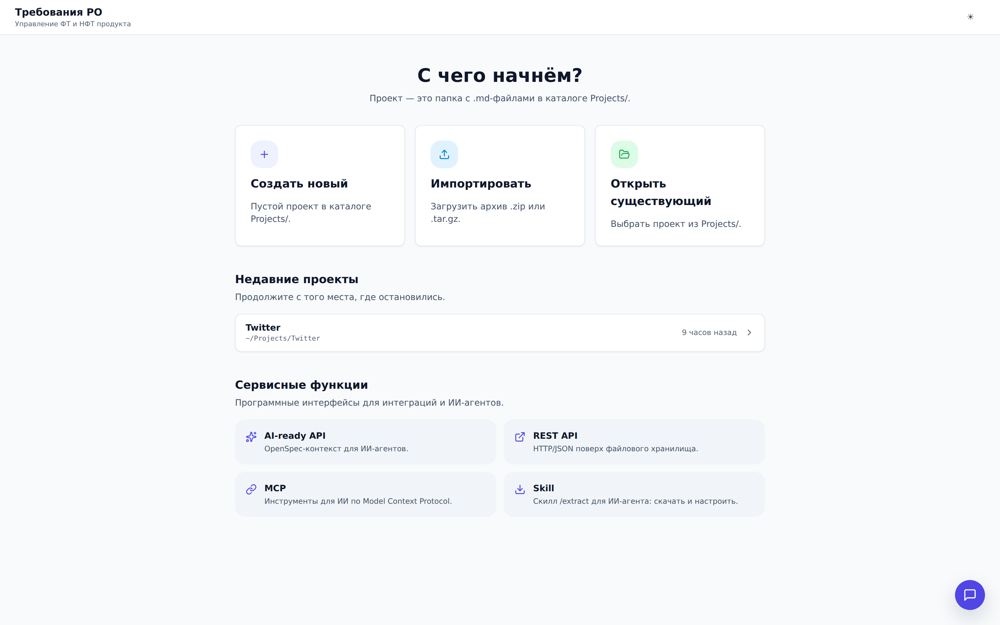               | 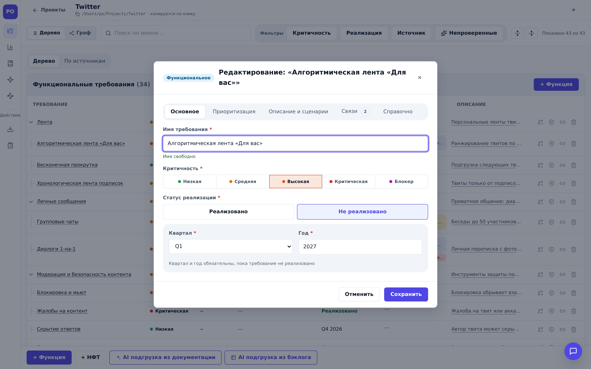 |
|                          **Справочники проекта**                           |                        **Тёмная тема**                         |
| 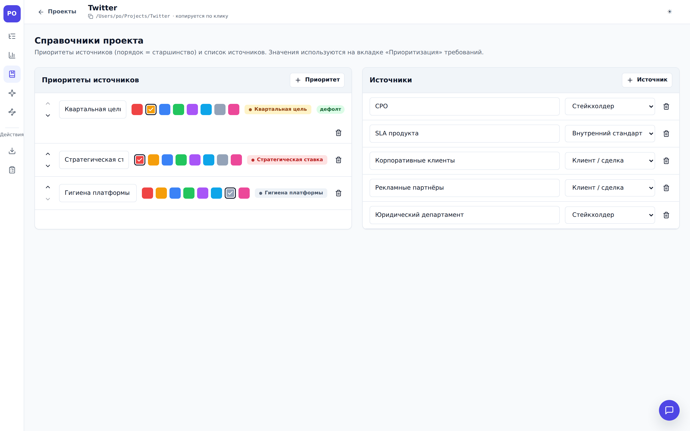 |    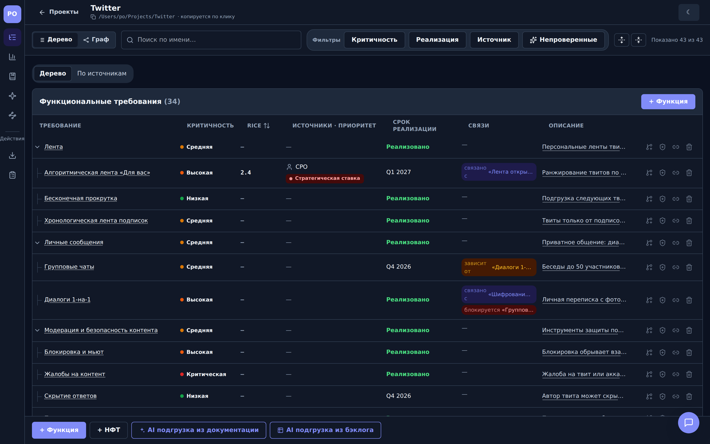     |

## Хранение данных

```
Projects/
├── .ai-config.json          # настройки AI-хаба + пресеты моделей (секрет, не экспортируется)
├── .locks/                  # файловые блокировки конкурентных мутаций (ADR-004)
└── <Имя проекта>/
    ├── openspec/
    │   ├── project.md       # паспорт проекта
    │   └── specs/
    │       ├── functions/   # ФТ: <slug>.md (OpenSpec + frontmatter)
    │       └── nfr/         # НФТ: <slug>.md
    ├── dictionaries.json    # справочники приоритетов и источников
    └── .ai-jobs/            # чекпоинты и логи AI-импортов (не экспортируется)
```

`.md` ⇄ requirement сериализация lossless (round-trip закреплён тестами): frontmatter —
метаданные (критичность, источники, сроки, `origin`/`aiValidated`), тело — OpenSpec-текст.
Старые файлы без новых полей читаются без миграций.

## Интеграция с ИИ-агентами

Три канала поверх одной доменной логики (см. экраны «Сервисные функции» на старте):

1. **AI-ready API (OpenSpec):**
   `GET /api/projects/:id/requirements?format=openspec` → `text/markdown` — склеенный
   OpenSpec-текст всего проекта, готовый контекст для агента:

   ```bash
   curl "http://localhost:3000/api/projects/<id>/requirements?format=openspec"
   ```

2. **REST API + Swagger:** интерактивная документация — `GET /docs` (Swagger UI,
   ассеты локальные), машиночитаемая спецификация — `GET /openapi.json` (OpenAPI 3.x).
   Все входы валидируются Zod-схемами из `@po/core`.

3. **MCP-сервер (stdio):**

   ```bash
   npm run build
   node apps/mcp/dist/main.js   # PROJECTS_ROOT переопределяется через env
   ```

   Инструменты: `list_projects`, `get_project`, `list_requirements`, `get_requirement`,
   `create_requirement`, `update_requirement`, `link_requirements`, `delete_requirement`,
   `export_project`. Входы валидируются теми же схемами, что и REST.

### Обзор REST API

Полная спецификация — `/docs` и `/openapi.json`; ниже карта поверхности.

| Группа      | Эндпоинты                                                                                                                                                                                                                                |
| ----------- | ---------------------------------------------------------------------------------------------------------------------------------------------------------------------------------------------------------------------------------------- |
| Проекты     | `GET/POST /api/projects` · `GET/DELETE /api/projects/:id`                                                                                                                                                                                |
| Требования  | `GET/POST /api/projects/:id/requirements` (`?format=json\|openspec`) · `PUT/DELETE .../requirements/:slug` · `GET .../requirements/check-name`                                                                                           |
| Связи       | `POST/DELETE /api/projects/:id/links`                                                                                                                                                                                                    |
| Архив/Excel | `POST /api/projects/import` · `GET /api/projects/:id/export` (`?format=zip\|targz`) · `POST .../export/selected` · `GET .../export.xlsx`                                                                                                 |
| Справочники | `GET /api/projects/:id/dictionaries` · `POST/PUT/DELETE .../dictionaries/priorities[/:pid]` · `POST/PUT/DELETE .../dictionaries/sources[/:sid]`                                                                                          |
| AI          | `GET/PUT /api/ai/config` · `GET /api/ai/models` · `POST /api/ai/chat` · `POST /api/ai/generate-description`                                                                                                                              |
| AI-импорт   | `POST /api/projects/:id/ai-import` · `POST /api/projects/:id/ai-backlog-import` · `GET .../ai-import/jobs` · `GET /api/ai-import/:jobId` · `POST .../cancel` · `POST .../confirm` · `POST .../apply` · `POST .../resume` · `GET .../log` |
| Служебное   | `GET /healthz` · `GET /docs` · `GET /openapi.json`                                                                                                                                                                                       |

Безопасность путей: все файловые операции проходят через `pathSafe` — пути строго внутри
`PROJECTS_ROOT`, path traversal отвергается с `400 PATH_UNSAFE` (NFR-5).

## Архитектура

Три слоя, зависимость строго в одну сторону: `web → (HTTP) → server → core`.

```
packages/core   @po/core   — доменное ядро: типы, Zod-схемы, RICE, OpenSpec-сериализация, граф связей
apps/server     @po/server — Fastify API (routes → services → repositories → fs), раздаёт SPA, Swagger
apps/web        @po/web    — React + Vite + TS + Tailwind (SPA): React Query + Zustand + RHF/Zod
apps/mcp        @po/mcp    — MCP-сервер (stdio) поверх сервисов
e2e                        — Playwright E2E против реального собранного приложения
```

- `packages/core` — чистая доменная логика без fs/http; валидация определяется один раз и
  переиспользуется сервером **и** формами веба (правила не дублируются). Покрытие ≥90% —
  гейт CI.
- `apps/server` — строгая слоистость: роуты только парсят HTTP и мапят ошибки в статусы;
  сервисы владеют use-case'ами и транзакционностью (удаление файла + зачистка висячих
  ссылок — атомарно); весь I/O — только в репозиториях. Запись — через `atomicWrite`,
  конкурентные мутации сериализуются project-lock'ами (ADR-004).
- Подробности и решения — `docs/overview/arch.md` и ADR в `docs/architecture/`
  (хранилище OpenSpec, MCP поверх сервисов, взаимные связи, конкурентность,
  один процесс SPA+API, версионирование REST, интеграция AI-хаба).

## Разработка

```bash
# Фронтенд в dev-режиме (Vite, проксирует /api → сервер; сервер запустите отдельно)
npm run dev -w @po/web

# Проверки (тот же порядок, что в CI)
npm run format:check   # Prettier
npm run lint           # ESLint
npm run typecheck      # tsc -b + typecheck веба
npm test               # unit + component (Vitest) с порогом покрытия ядра ≥90%
npm run e2e            # E2E (Playwright): собирает и поднимает реальное приложение
npm run test:perf      # перф-тесты сервера (opt-in, RUN_PERF=1)
```

- **Один unit-тест:** `npx vitest run packages/core/src/md/markdown.test.ts`
  (фильтр по имени: `-t "…"`).
- **Один E2E-файл:** `npx playwright test e2e/tests/happy-path.spec.ts`.
- E2E запускается серийно (общий сервер) против одноразового `PROJECTS_ROOT` во временной
  директории; изоляция — уникальными именами проектов. AI-тракт покрыт стабом хаба и
  живым MockServer; есть a11y-проверки (`@axe-core/playwright`).
- CI (`.github/workflows/ci.yml`): format:check → lint → typecheck → unit (coverage-гейт)
  → e2e. Держите все ступени зелёными.
- `pack.sh` собирает zip-дистрибутив для запуска на другой машине (с примером проекта
  `Projects/Jenkins`, без секретов и служебных каталогов).

## Документация

| Где                        | Что                                                                     |
| -------------------------- | ----------------------------------------------------------------------- |
| `docs/overview/project.md` | ТЗ: функциональные (FR) и нефункциональные (NFR) требования             |
| `docs/overview/arch.md`    | Архитектура, таблица API, потоки данных                                 |
| `docs/architecture/`       | ADR-001…007, план доработки, матрица тест-ситуаций, набросок API        |
| `docs/tasks/`              | Декомпозиция на эпики E1–E16 (foundation → AI → UX → OpenAPI → таблица) |
| `docs/design/`             | Дизайн-макеты (HTML + Tailwind), токены, style-guide — `index.html`     |
| `docs/product/`            | Vision board, roadmap, метрики, известные пробелы                       |
| `docs/po/`, `docs/qa/`     | UX-ревью PO, чартеры исследовательского тестирования                    |
| `docs/RELEASE_NOTES.md`    | Подробная история изменений по релизам                                  |
| `CLAUDE.md`                | Заметки для работы ИИ-агентов в репозитории                             |

Документация ведётся на русском; код и идентификаторы — на английском.
